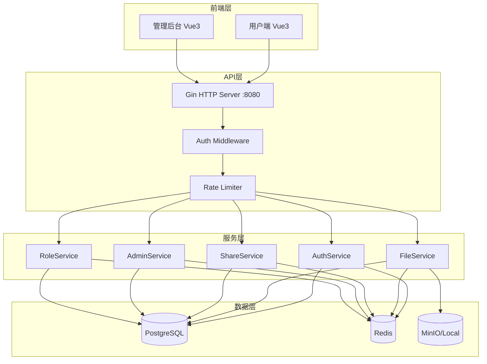

# NetFileSys 项目分析报告

## 项目概述

**NetFileSys** 是一个基于 **Go + Vue3** 的企业级网络文件管理系统，采用前后端分离架构。

| 层级 | 技术栈 |
|------|--------|
| **前端** | Vue 3 + TypeScript + Element Plus + Vite + Pinia |
| **后端** | Go 1.21+ + Gin (HTTP) + GORM (ORM) |
| **数据库** | PostgreSQL 13+ |
| **缓存** | Redis 6+ |
| **存储** | MinIO / 本地存储 |
| **认证** | JWT |

---

## 系统架构



---

## 核心功能模块

### 1. 文件管理
- **上传**: 支持秒传(MD5去重)、分片上传、断点续传
- **操作**: 下载、预览、删除、移动、复制、重命名
- **批量**: 批量删除/移动/复制
- **版本**: 文件多版本管理

### 2. 文件夹管理
- 多级文件夹层级结构
- 树形导航与路径追踪

### 3. 分享功能
- **分享链接**: 生成唯一8位分享码
- **安全控制**: 密码保护、有效期限制、下载次数限制
- **IP限制**: 可配置IP白名单

### 4. 权限系统 (RBAC + ACL)
- **角色权限**: 用户-角色-权限多对多关系
- **细粒度ACL**: 对象级权限控制
- **权限位**: `READ=1, WRITE=2, DELETE=4, SHARE=8, DOWNLOAD=16`

### 5. 用户与组织
- 用户注册/登录/密码策略
- 多级组织架构 (公司→部门→用户)
- 登录日志与异地提醒

### 6. 回收站
- 软删除 + 30天自动清理
- 文件恢复功能

### 7. 审计日志
- 文件操作日志 (`file_op_log`)
- 登录日志 (`login_log`)
- 分享访问日志 (`share_log`)
- 管理员操作日志 (`admin_log`)

### 8. 管理后台
- 用户/文件/分享全局管理
- 系统统计Dashboard
- 存储使用监控

---

## 项目目录结构

```
system-netfiles/
├── cmd/
│   ├── server/main.go        # 主服务入口
│   ├── migrate/              # 数据库迁移
│   └── create_admin/         # 创建管理员
├── internal/
│   ├── api/                  # HTTP Handler层 (12个handler)
│   ├── service/              # 业务逻辑层 (16个service)
│   ├── model/models.go       # 数据模型 (20+实体)
│   ├── middleware/           # 中间件 (auth/rate_limiter/cors等)
│   ├── config/               # 配置管理
│   ├── pkg/                  # 工具包 (db/storage/response/cache)
│   └── repository/           # 数据访问层
├── frontend/                 # Vue3前端项目
│   ├── src/views/           # 17个视图
│   ├── src/api/             # 13个API模块
│   └── src/components/      # 12个组件
├── docker-compose.yml
└── go.mod
```

---

## 🔍 关键功能检查结果

### ❌ 用户存储空间限制 (User Storage Quota)

> [!CAUTION]
> **当前项目 未实现 用户级别的存储空间限制功能**

**缺失项分析：**

| 检查项 | 状态 | 说明 |
|--------|------|------|
| User模型quota字段 | ❌ | [models.go](file:///Users/kyren/workspace/system-netfiles/internal/model/models.go#L10-L22) 中 `User` 结构体无 `StorageQuota` 或 `UsedStorage` 字段 |
| 上传前配额检查 | ❌ | [file_handler.go](file:///Users/kyren/workspace/system-netfiles/internal/api/file_handler.go) 的上传接口无存储配额校验逻辑 |
| 配额管理接口 | ❌ | 无设置/查询用户配额的API |
| 前端配额显示 | ❌ | 用户界面无个人存储使用量展示 |

**现有相关功能：**
- ✅ 系统级存储统计 (`GetStorageStats`) 可查看总体存储使用
- ✅ 单文件上传大小限制 (`max_upload_size: 100MB`)
- ✅ 管理后台可查看各用户存储占用排行

---

### ⚠️ 下载速率限制 (Download Rate Limiting)

> [!WARNING]
> **当前项目 未实现 文件下载带宽/速率限制功能**

**现有API请求频率限制：**

| 限制类型 | 配置值 | 适用范围 |
|----------|--------|----------|
| 登录接口 | 5次/分钟 | `/api/auth/login` |
| 上传接口 | 20次/分钟 | 文件上传相关 |
| 默认API | 60次/分钟 | 一般API端点 |
| 全局限制 | 100次/分钟 | 所有请求 |

**速率限制实现位置:** [rate_limiter.go](file:///Users/kyren/workspace/system-netfiles/internal/middleware/rate_limiter.go)

**关键区别：**
- ✅ **有**: API请求次数限制 (防止暴力攻击/滥用)
- ❌ **无**: 下载带宽限速 (如 1MB/s)
- ❌ **无**: 按用户/文件的下载速度控制

**下载实现分析：**
```go
// file_handler.go:155-167
func (h *FileHandler) DownloadFile(c *gin.Context) {
    // ... 权限检查 ...
    c.FileAttachment(file.Path, file.Name)  // 直接提供文件，无速率控制
}
```

---

## 安全特性汇总

| 特性 | 状态 | 实现 |
|------|------|------|
| JWT认证 | ✅ | 无状态Token认证 |
| RBAC权限 | ✅ | 角色-权限映射 |
| ACL细粒度 | ✅ | 对象级权限控制 |
| 登录防护 | ✅ | 5次/分钟限制 |
| API限流 | ✅ | Redis/Memory存储 |
| 密码策略 | ✅ | 复杂度+历史记录 |
| 操作审计 | ✅ | 多类型日志记录 |
| 用户配额 | ❌ | 未实现 |
| 下载限速 | ❌ | 未实现 |

---

## 总结

NetFileSys 是一个功能较完整的企业级文件管理系统，具备：
- 完善的文件上传/下载/分享核心功能
- 成熟的RBAC+ACL权限体系
- 完整的审计日志系统

**核心缺失功能：**
1. ❌ **用户存储配额限制** - 无法控制单个用户的最大存储空间
2. ❌ **下载速率限制** - 无法限制文件下载带宽/速度

如需实现这两个功能，建议后续添加相应的模型字段、中间件和API接口。
